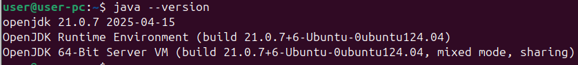
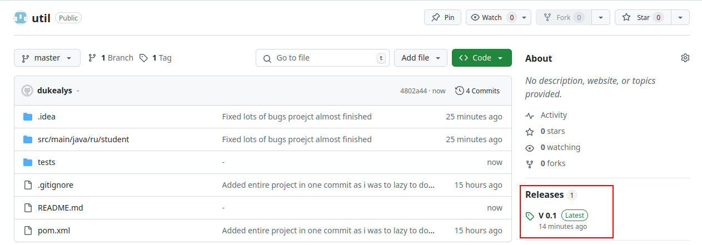
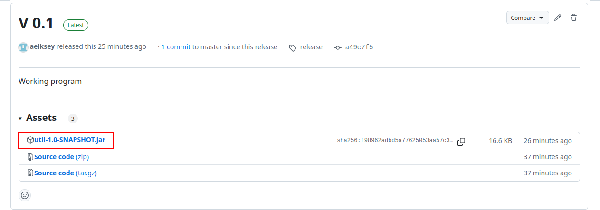
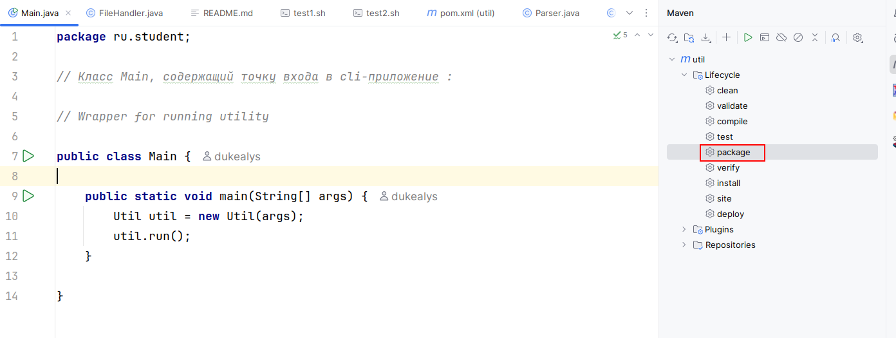
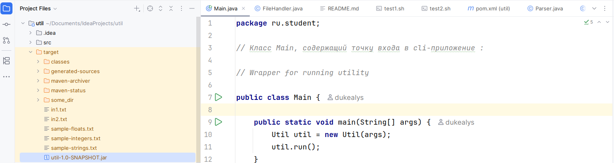

## Справочная информация

### Версия java:

openjdk 21.0.7 2025-04-15 (Java21 LTS)

### Используемая build-система:

Apache Maven 3.9.9 (8e8579a9e76f7d015ee5ec7bfcdc97d260186937)

## Особенности реализации

Добавлен флаг -h для отображения справки по утилите

## Инструкция по запуску

### Вариант 1. Прекомпилированный jar

1. Перейти в раздел releases репозитория на GitHub

2. Кликнуть на выделенный файл, что начнёт его загрузку

3. Переместить файл в любую удобную директорию

4. Запустить файл командой: `java -jar util-1.0-SNAPSHOT.jar`

Программа отобразит справку для простоты дальнейшего использования

### Вариант 2. Компиляция из исходного кода с помощью IntelJDEA

1. Склонировать или скачать репозиторий на собственный ПК.

2. Открыть проект в IDE IntelJDEA

3. Через GUI maven запустить цель билда package(кликнуть по ней два раза):

4. Перейти в директорию target

Далнейшие шаги аналогичны пунктам 3 и 4 варианта запуска 1.

### Вариант 3. Запуск прилагаемых к репозиторию в директории tests bash скриптов для проверки работоспособности:

1. Склонировать или скачать репозиторий на собственный ПК.

2. Открыть директорию tests

3. Запустить тестирующие программы командами:

`sh test1.sh` или `sh test2.sh`